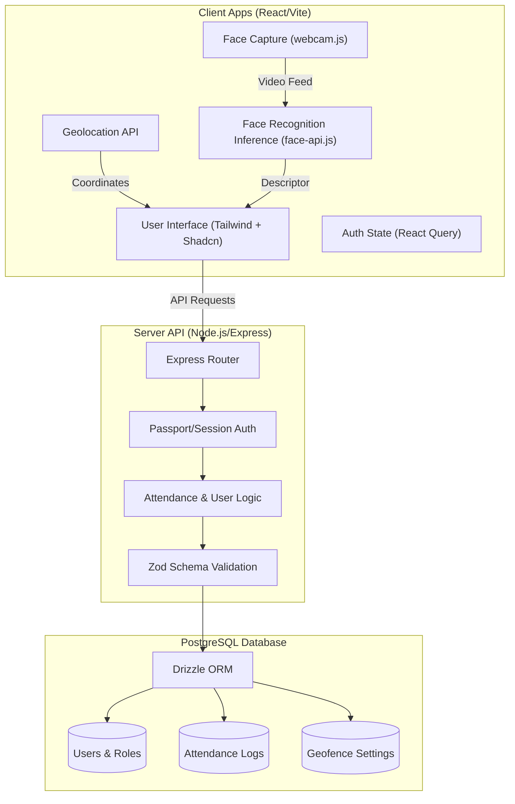

# 📍 Geo-Location + Face Recognition Attendance System

A production-ready attendance tracking system built with a modern full-stack architecture. This application ensures secure, location-verified, and biometrically validated student attendance.

## 🏗️ System Architecture

## 🚀 Tech Stack

### Frontend
- **Framework:** React.js (built with Vite for fast HMR and compilation)
- **Styling:** Tailwind CSS
- **UI Components:** Shadcn UI (built on Radix UI primitives)
- **Animations:** Framer Motion
- **Routing & State:** Wouter & TanStack React Query

### Backend
- **Runtime & Framework:** Node.js with Express.js (v5)
- **Database:** PostgreSQL managed via Drizzle ORM
- **Authentication:** Passport.js with Express-Session (or JWT) & Bcrypt for secure password hashing
- **Validation:** Zod for strictly typed end-to-end schemas

### AI / Geolocation
- **Face Recognition:** `@vladmandic/face-api` (optimized `face-api.js` fork) for in-browser, real-time facial recognition generating 128-dimensional descriptors.
- **Geolocation:** Native Browser Geolocation API combined with the Haversine formula for highly accurate distance validation.

---

## 🛠️ Core Features

### 1. Authentication & Roles
- **Secure Login:** Dedicated role-based access for `Admin` and `Student` accounts.
- **Session Protection:** Sensitive routes and API endpoints are protected via secure authentication sessions and cookies.

### 2. Admin Panel
- **Student Enrollment:** Register new students using their specific **Register Number** (serving as the unique ID), along with name, email, and a baseline 3D face scan captured directly via webcam.
- **Geofence Management:** Dynamically configure the "Official Campus/Classroom Location" (Latitude & Longitude) and define the allowed check-in radius (e.g., 20m or 200m).
- **Attendance Monitoring:** View a comprehensive, real-time dashboard of student check-ins, displaying their `PRESENT`/`ABSENT` status, timestamp, and their exact distance from the allowed center point during check-in.

### 3. Student Portal
- **Verification Workflow (The core loop):**
  - **Step 1:** System captures the student's current GPS location.
  - **Step 2:** Fast face scan is captured via webcam.
  - **Step 3:** System executes face-matching, comparing the live scan to the baseline enrolled face data (validating if Euclidean distance `< 0.6`).
  - **Step 4:** System calculates the coordinates using the Haversine formula to confirm the student is within the active geofence.
  - **Outcome:** If both Biometrics and Geolocation pass, attendance is successfully marked!
- **Attendance History:** Students have access to a personal, filterable log of all their past check-ins.

---

## 📂 Project Structure

A clean, monorepo-style architecture ensuring separation of concerns while maximizing type safety:

- **`client/`** — Contains all React frontend pages, UI components, webcam face-scanning logic, and API fetching hooks.
- **`server/`** — Houses the Express API routes, authentication logic, middleware, and database transaction handlers.
- **`shared/`** — The source of truth for both environments, containing shared TypeScript types, Drizzle database schemas (`schema.ts`), and Zod validation logic.

---

## 🔑 Default Credentials

To get started immediately after setting up the database, use the following default access:

- **Admin Account:** 
  - **Email:** `admin@example.com`
  - **Password:** `admin123` *(Check your backend seeding script if a different default applies)*
- **Student Accounts:** 
  - Students must be created and enrolled manually via the Admin panel to capture their initial biometric profile.
